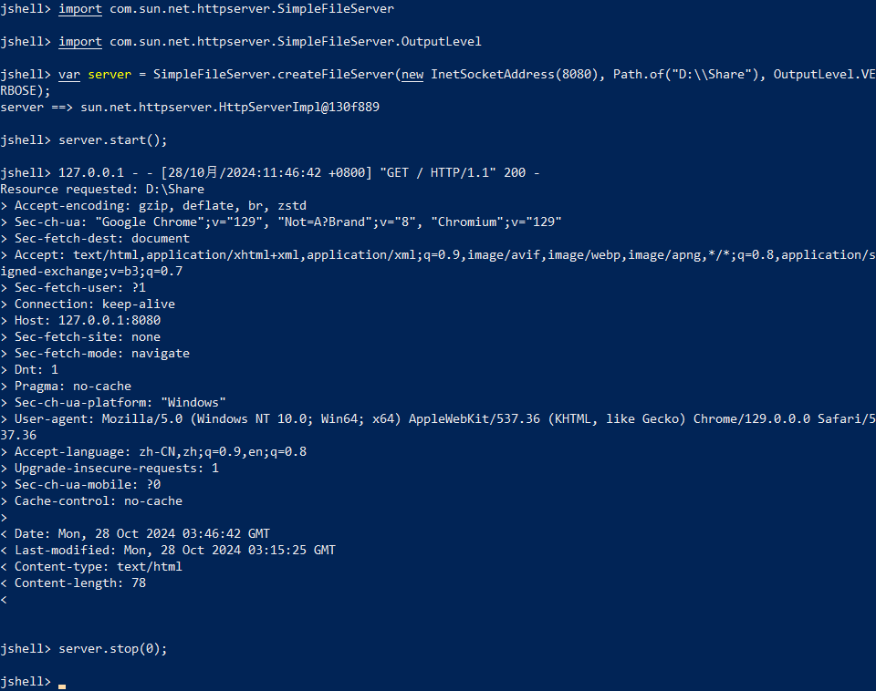

# JDK新特性

## JDK9

1. jshell：Java 命令行工具（[JEP 222: jshell: The Java Shell (Read-Eval-Print Loop)](https://openjdk.org/jeps/222)）
   
   JShell 是 Java 9 新增的一个实用工具。为 Java 提供了类似于 Python 的实时命令行交互工具。在 JShell 中可以直接输入表达式并查看其执行结果，对于简单语法或功能的测试，无需再新建工程。
   
   

2. 集合的便捷工厂方法（[JEP 269: Convenience Factory Methods for Collections](https://openjdk.org/jeps/269)）
   
   增加了`List.of()`、`Set.of()`、`Map.of()`、`Map.entry()`和 `Map.ofEntries()`静态工厂方法来创建不可变集合。简化了集合类型常量的定义，而不再依赖第三方库。
   
   ```java
   List.of("a", "b", "c");
   Set.of("a", "b", "c");
   Map.of("k1", "v1", "k2", "v2", "k3", "v3");
   Map.ofEntries(
     Map.entry("k1", "v1"),
     Map.entry("k2", "v2"),
     Map.entry("k3", "v3"));
   ```

3. Stream 和 Optional 增强
   
   `Stream` 中增加了新的方法 `ofNullable()`、`dropWhile()`、`takeWhile()` 以及 `iterate()` 方法的重载方法。`Optional` 类中新增了 `ifPresentOrElse()`、`or()` 和 `stream()` 等方法。`Optional` 类中的 `ifPresentOrElse()`解决了需要是否为空分别做   处理的痛点，避免了 if-else 的使用。
   
   ```java
   Optional.ofNullable("value").ifPresentOrElse(
       value -> System.out.println("Do something with value."),
       () -> System.out.println("Do something else without value."));
   ```

4. try-with-resources 增强
   
   允许在 try-with-resources 语句中可以使用 effectively-final 变量，不再要求声明过程位于 try 块中。这样在 catch 块中，以及整个 try-with-resources 语句之外仍可访问声明的变量。
   
   ```java
   StringWriter stringWriter = new StringWriter();
   BufferedWriter bufferedWriter = new BufferedWriter(stringWriter);
   try (stringWriter; bufferedWriter) {
       // Do something.
   } catch (IOException e) {
       // Do something with exception.
   }
   // Do something else.
   ```

5. 接口私有方法
   
   允许在接口中使用私有方法。接口的使用更加灵活，像是一个简化版的抽象类。
   
   ```java
   public interface MyInterface {
       private void methodPrivate(){
       }
   }
   ```

6. 其他重要特性：
   
   - 模块化系统（[JEP 261: Module System](https://openjdk.org/jeps/261)）
   - 响应式流 （Reactive Streams）
   - I/O 流的新特性
   - 变量句柄（[JEP 193: Variable Handles](https://openjdk.org/jeps/193)）
   - G1 成为默认垃圾回收器（[JEP 248: Make G1 the Default Garbage Collector](https://openjdk.org/jeps/248)）

## JDK10

1. 局部变量类型推断（[JEP 286: Local-Variable Type Inference](https://openjdk.java.net/jeps/286)）
   
   提供了 `var` 关键字声明局部变量，无需显式声明变量类型。
   
   ```java
   var list = new ArrayList<String>();
   for (var s : list) {
       System.out.println(s);
   }
   ```
   
   `var` 关键字由编译器完成推断后即会固定下来，变量也就不能再赋值为其他类型的值，所以并不会改变 Java 是一门静态类型语言的事实。`var` 关键字也存在一些局限性，例如以下几种场景均无法编译通过。
   
   ```java
   var count = null; // 不能声明为 null
   var lambda = s -> System.out.println(s); // 不能声明为 Lambda 表达式
   var array = {1, 2, 3}; // 不能声明数组
   public void method(var arg){} // 不能声明方法参数
   ```

2. 集合增强
   
   `List`，`Set`，`Map` 提供了静态方法`copyOf()`返回入参集合的一个不可变拷贝。
   
   ```java
   List<Integer> copy = List.copyOf(Arrays.asList(1, 2, 3));
   ```

3. 其他重要特性：
   
   - G1 并行 Full GC（[JEP 307: Parallel Full GC for G1](https://openjdk.java.net/jeps/307)）

## JDK 11

1. HTTP Client（[JEP 321: HTTP Client API](https://openjdk.java.net/jeps/321)）
   
   Java 11 对 Java 9 中引入并在 Java 10 中进行了更新的 Http Client API 进行了标准化，在前两个版本中进行孵化的同时，Http Client 几乎被完全重写，并且现在完全支持异步非阻塞。
   
   ```java
   HttpClient client = HttpClient.newHttpClient();
   HttpRequest request = HttpRequest.newBuilder()
       .uri(URI.create("http://openjdk.java.net/"))
       .build();
   // 同步
   HttpResponse<String> response = client.send(request, HttpResponse.BodyHandlers.ofString());
   System.out.println(response.body());
   // 异步
   client.sendAsync(request, HttpResponse.BodyHandlers.ofString())
       .thenApply(HttpResponse::body)
       .thenAccept(System.out::println);
   ```

2. 启动单文件源代码程序（[JEP 330: Launch Single-File Source-Code Programs](https://openjdk.java.net/jeps/330)）
   
   这意味着我们可以运行单一文件的 Java 源代码。此功能允许使用 Java 解释器直接执行 Java 源代码。源代码在内存中编译，然后由解释器执行，不需要在磁盘上生成 `.class` 文件了。唯一的约束在于所有相关的类必须定义在同一个 Java 文件中。
   
   
   
   对于 Java 初学者并希望尝试简单程序的人特别有用，并且能和 jshell 一起使用，一定程度上增强了使用 Java 来写脚本程序的能力。
   
   

3. String 增强
   
   `String`提供了一组新的方法如下：
   
   ```java
   // 判断字符串是否为空或仅包含空字符
   " ".isBlank(); // true
   // 去除字符串首尾空格
   " Java ".strip(); // "Java"
   // 去除字符串首部空格
   " Java ".stripLeading(); // "Java "
   // 去除字符串尾部空格
   " Java ".stripTrailing(); // " Java"
   // 重复字符串指定次数
   "Java".repeat(3); // "JavaJavaJava"
   // 返回由行终止符分隔的字符串Stream
   "A\nB\nC".lines().count(); // 3
   "A\nB\nC".lines().collect(Collectors.toList());
   ```

4. 其他重要特性：
   
   - Lambda 参数的局部变量语法（[JEP 323: Local-Variable Syntax for Lambda Parameters](https://openjdk.java.net/jeps/323)）
   - 传输层安全(TLS)1.3（[JEP 332: Transport Layer Security (TLS) 1.3](https://openjdk.org/jeps/332)）
   - 飞行记录器（[JEP 328: Flight Recorder](https://openjdk.org/jeps/328)）

## JDK14

1. Switch 表达式（[JEP 361: Switch Expressions](https://openjdk.org/jeps/361)）
   
   Java12 为 `switch` 表达式引入了类似 lambda 语法条件匹配成功后的执行块，不需要多写 `break` ，Java13 提供了 `yield` 来在 block 中返回值。
   
   ```java
   int numLetters = switch (day) {
       case MONDAY, FRIDAY, SUNDAY -> 6;
       case TUESDAY -> 7;
       case THURSDAY, SATURDAY -> 8;
       case WEDNESDAY -> 9;
       default -> {
           if (day == null) {
               yield -1;
           }
           yield day.getValue(); 
       }
   };
   ```

2. 有帮助的 NullPointerExceptions（[JEP 358: Helpful NullPointerExceptions](https://openjdk.org/jeps/358)）
   
   通过 JVM 参数中添加`-XX:+ShowCodeDetailsInExceptionMessages`，可以在空指针异常中获取更为详细的调用信息，更快的   定位和解决问题。
   
   ```plain
   Exception in thread "main" java.lang.NullPointerException: 
           Cannot assign field "i" because "a" is null
       at Prog.main(Prog.java:5)
   ```

## JDK15

1. 文本块（[JEP 378: Text Blocks](https://openjdk.org/jeps/378)）
   
   文本块是一个多行字符串，它可以避免使用大多数转义符号，自动以可预测的方式格式化字符串，并让开发人员在需要时可以控制格式。
   
   ```java
   String query = """
       SELECT "EMP_ID", "LAST_NAME" FROM "EMPLOYEE_TB"
       WHERE "CITY" = 'INDIANAPOLIS'
       ORDER BY "EMP_ID", "LAST_NAME";
       """;
   ```

2. 其他重要特性：
   
   - 隐藏类（[JEP 371: Hidden Classes](https://openjdk.org/jeps/371)）
   - ZGC: 可伸缩低延迟垃圾收集器（[JEP 377: ZGC: A Scalable Low-Latency Garbage Collector (Production)](https://openjdk.org/jeps/377)）
   - Shenandoah：低暂停时间垃圾收集器（[JEP 379: Shenandoah: A Low-Pause-Time Garbage Collector (Production)](https://openjdk.org/jeps/379)）
   - 移除Nashorn JavaScript引擎（[JEP 372: Remove the Nashorn JavaScript Engine](https://openjdk.org/jeps/372)）

## JDK16

1. 记录类型（[JEP 395: Records](https://openjdk.org/jeps/395)）
   
   `record` 提供一种紧凑的语法来定义类中的不可变数据。使用 `record` 代替 `class` 定义的类，只需要声明属性，就可以在获得属性的访问方法，以及 `toString()`，`hashCode()`, `equals()`方法。可以替代Lombok的部分能力。
   
   ```java
   // record形式
   record Point(int x, int y) { }
   // 等价形式
   class Point {
       private final int x;
       private final int y;
   
       Point(int x, int y) {
           this.x = x;
           this.y = y;
       }
   
       int x() { return x; }
       int y() { return y; }
   
       public boolean equals(Object o) {
           if (!(o instanceof Point)) return false;
           Point other = (Point) o;
           return other.x == x && other.y == y;
       }
   
       public int hashCode() {
           return Objects.hash(x, y);
       }
   
       public String toString() {
           return String.format("Point[x=%d, y=%d]", x, y);
       }
   }
   ```

2. instanceof 模式匹配（[JEP 394: Pattern Matching for instanceof](https://openjdk.org/jeps/394)）
   
   `instanceof`关键词在类型检查的基础上，整合了类型转换的能力，可以简化常用操作。
   
   ```java
   if (obj instanceof String s) {
       System.out.println(s.indent(4));
   }
   ```

3. 其他重要特性：
   
   - 打包工具（[JEP 392: Packaging Tool](https://openjdk.org/jeps/392)）
   - Unix-Domain 套接字通道（[JEP 380: Unix-Domain Socket Channels](https://openjdk.org/jeps/380)）

## JDK17

1. 密封类（[JEP 409: Sealed Classes](https://openjdk.org/jeps/409)）
   
   引入了`sealed class`和`interfaces`来声明密封类和接口，密封类和接口通过`permits`限制哪些其他类或接口可以扩展或实现它们。
   
   ```java
   public abstract sealed class Shape
       permits Circle, Rectangle, Square { ... }
   public final class Circle extends Shape { ... }
   public final class Apple extends Shape { ... } // 禁止继承
   
   sealed interface Celestial 
       permits Planet, Star, Comet { ... }
   final class Planet implements Celestial { ... }
   final class Car implements Celestial { ... } // 禁止实现
   ```

2. 其他重要特性：
   
   - 增强的伪随机数生成器（[JEP 356: Enhanced Pseudo-Random Number Generators](https://openjdk.org/jeps/356)）
   - 弃用 Applet API 以进行删除（[JEP 398: Deprecate the Applet API for Removal](https://openjdk.org/jeps/398)）
   - 弃用安全管理器以进行删除（[JEP 411: Deprecate the Security Manager for Removal](https://openjdk.org/jeps/411)）

## JDK18

1. 默认字符集UTF-8（[JEP 400: UTF-8 by Default](https://openjdk.org/jeps/400)）
   
   JDK 终于将 UTF-8 设置为默认字符集。在之前的版本中，默认字符集是在 Java 虚拟机运行时才确定的，取决于不同的操作系统、区域设置等因素，可能导致开发与运行阶段结果不一致。
   
   即使当前提供了统一的默认值，仍然建议在相关操作中显式指定字符集，避免运行环境默认值被修改。
   
   如果在 Windows 命令行中遇到乱码，可能是由于命令行窗口默认使用的字符集不是 UTF-8，可以使用`chcp 65001`命令将当前窗口临时设置为 UTF-8 字符集，`chcp 936`命令可以将其还原为 GBK。

2. 简单Web服务器（[JEP 408: Simple Web Server](https://openjdk.org/jeps/408)）
   
   提供了一个迷你Web服务器，用做测试和学习目的，仅支持静态文件服务，不支持各种高级特性。
   
   支持通过命令行工具 jwebserver 启动。
   
   
   
   同时提供了 Java API用于启动和管理，当然也支持从 jshell 中执行。
   
   

3. 其他重要特性：
   
   - Java API 文档中的代码片段（[JEP 413: Code Snippets in Java API Documentation](https://openjdk.org/jeps/413)）
   - 启用finalize方法以进行删除（[JEP 421: Deprecate Finalization for Removal](https://openjdk.org/jeps/421)）

## JDK21

1. 记录类型模式匹配（[JEP 440: Record Patterns](https://openjdk.org/jeps/440)）
   
   `instanceof`关键词在类型检查与类型转换的能力的基础上，针对`record`类型进行了增强，支持展   开其内部的字段，并且支持嵌套展开。
   
   ```java
   record Size(int width, int height) { }
   record Point(int x, int y) { }
   record Window(Point point, Size size) { }
   
   if (obj instanceof Window(Point point, Size(int width, int height))) {
    System.out.println("Height: " + height);
   }
   ```

2. switch 模式匹配（[JEP 441: Pattern Matching for switch](https://openjdk.org/jeps/441)）
   
   `switch`表达式支持类型检查，针对不同类型完成特定操作。当存在多个子类实现时，这个特性可以起到作用。
   
   ```java
   static String formatterPatternSwitch(Object obj) {
       return switch (obj) {
           case null      -> "Oops";
           case Integer i -> String.format("int %d", i);
           case Long l    -> String.format("long %d", l);
           case Double d  -> String.format("double %f", d);
           case String s  -> String.format("String %s", s);
           default        -> obj.toString();
       };
   }
   ```

3. 虚拟线程（[JEP 444: Virtual Threads](https://openjdk.org/jeps/444)）
   
   虚拟线程，也称为“用户模式线程（user-mode threads）”，该功能旨在简化并发编程并提供更好的可扩展性。
   
   虚拟线程是轻量级的，这意味着它们可以比传统线程创建更多数量，并且开销要少得多。
   
   同时，虚拟线程的调度完全由 JVM 管理，JVM 会在平台线程空闲时将虚拟线程分配给它们执行。
   
   在虚拟线程中，阻塞操作不会阻塞底层的操作系统线程，避免了资源浪费， 这使得虚拟线程非常适合处理高并发、I/O 密集型的任务。  
   
   如果任务涉及大量 CPU 密集型操作，虚拟线程带来的优势可能不明显。在这种情况下，平台线程也许是更好的选择。
   
   另外需要注意，虚拟线程并不昂贵，因此永远不需要将它们池化。如果需要限制并发，可以使用信号量`Semaphore`。
   
   以下是虚拟线程的几种创建方式。
   
   ```java
   // 使用线程池
   try (ExecutorService pool = Executors.newVirtualThreadPerTaskExecutor()) {
       for (int i = 0; i < 100; i++) {
           int finalI = i;
           pool.submit(() -> System.out.println(finalI));
       }
   }
   
   // 使用静态方法
   Thread virtualThread = Thread.startVirtualThread(() -> System.out.println("test"));
   
   // 使用构造器
   Thread virtualThread = Thread.ofVirtual()
           .name("test-virtual-thread")
           .start(() -> System.out.println("test"));
   
   // 使用工厂
   ThreadFactory factory = Thread.ofVirtual()
           .name("test", 0)
           .factory();
   Thread virtualThread = factory.newThread(() -> System.out.println("test"));
   virtualThread.start();
   ```

4. 其他重要特性：
   
   - 序列化集合（[JEP 413: Code Snippets in Java API Documentation](https://openjdk.org/jeps/413)）
   - 分代 ZGC（[JEP 439: Generational ZGC](https://openjdk.org/jeps/439)）
